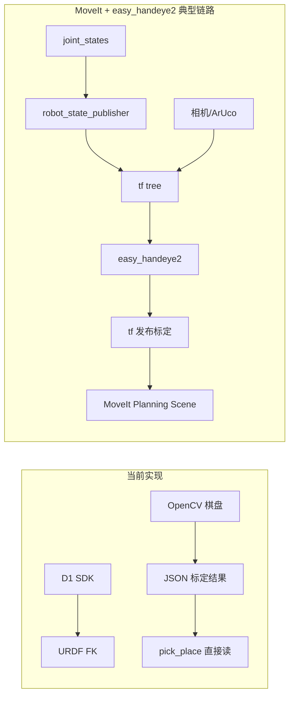

# 与 easy_handeye2 / MoveIt 差距分析

本文对比本项目 [`calibate/`](../../calibate/) 手眼标定实现与两类外部工具的定位差异，并给出优化优先级。

## 三者定位

| 工具 | 本质 |
|------|------|
| [MoveIt](https://moveit.picknik.ai/humble/doc/concepts/concepts.html) | 运动规划框架：运动学、规划、场景监控、轨迹处理，**不是**手眼标定工具 |
| [easy_handeye2](https://github.com/marcoesposito1988/easy_handeye2) | ROS2 手眼标定中间件：通过 `tf` 采样 → OpenCV 求解 → 发布 `tf` |
| 本项目 `calibate` | D1 专用离线标定流水线：采集 → 求解 → JSON 结果 → `pick_place` 直接读取 |

主要对标对象是 **easy_handeye2**；MoveIt 的价值在于标定位姿如何安全、多样地采集，以及标定结果如何进入规划链。

## 当前实现的优势（应保留）

### 1. D1 全流程自动化

[`auto_collect.py`](../../calibate/common/auto_collect.py) 提供真机专用流程，超出通用 handeye 包范围：

- 折叠位姿 → 倒计时卸力 → 手动摆位 → Enter 开始
- adaptive 模式：锚点 + 小步关节扰动，避免棋盘出视野
- 眼在手外：根据棋盘距离自动设置 j6 并夹紧
- 插值运动 + 逐段可见性校验
- 退出时安全回折叠位姿

### 2. 多算法融合求解

[`hand_eye_solve.py`](../../calibate/common/hand_eye_solve.py) 支持 Tsai、Park、Horaud、Andreff、Daniilidis 五种 OpenCV 算法，并可按残差加权融合（`fused` 模式）。easy_handeye2 默认使用单一算法。

### 3. 双相机联合应用

[`combined/hand_eye_fusion.py`](../../calibate/combined/hand_eye_fusion.py) 支持手外粗定位 + 手上精定位融合，是项目差异化能力，不在 easy_handeye2 设计范围内。

### 4. 无 ROS 依赖

conda + OpenCV + D1 SDK 即可运行，与 [`pick_place/`](../../pick_place/) JSON 流水线直接对接，部署成本低。

### 5. 采集质量控制与验证报告

- 棋盘边缘裕量检测、跳过出视野样本
- [`calib_report.py`](../../calibate/common/calib_report.py) 提供残差统计与质量评级（优秀/良好/可用/较差）

## 相对 easy_handeye2 的主要不足

| 维度 | easy_handeye2 | 本项目 |
|------|---------------|--------|
| 坐标系集成 | `tf` 树，`robot_base` / `ee` / `optical` / `marker` 四帧 | 静态 JSON（`T_cam_base`、`T_cam_gripper`） |
| 在线热更新 | `publish.launch` 启动即发布，重标定后重启节点 | 需手动替换 JSON 或重启应用 |
| 机器人位姿 | `robot_state_publisher` 发布的 `tf` | URDF FK + D1 关节读数 |
| 视觉跟踪 | 任意能发 `tf` 的系统（常配合 ArUco） | 仅棋盘格 OpenCV 角点 |
| 标定 GUI | 逐样本确认/丢弃、RViz 可视化 | `debug_display` 调试面板，非标准标定 GUI |
| 多标定管理 | 命名空间（`my_eob_calib` / `my_eih_calib`） | 结果散落在 `eye_*/output/` |
| 时间同步 | 同一时刻采 robot `tf` + marker `tf` | 到位 → 等待 → 拍照 → 读关节（无时间戳对齐） |

### 影响

- 无法与 ROS 感知/规划节点直接拼 `tf` 链路
- URDF 与真机偏差、关节零点误差会直接进入手外参（easy_handeye2 文档同样强调需标定机器人）
- 大视角、光照差场景下棋盘不如 ArUco 鲁棒

## 相对 MoveIt 生态的不足

MoveIt 提供运动学、碰撞感知规划、Planning Scene Monitor 等能力。本项目当前：

- 采姿仅在关节空间小步扰动（[`pose_planner.py`](../../calibate/common/pose_planner.py)），**不考虑碰撞**（桌面、相机架、自身）
- **不保证旋转充分**（Tsai 算法建议各轴尽量大角度旋转）
- 标定结果不进 `tf` 树，MoveIt 无法直接用于「相机系 → 基座系」变换
- 无 `move_group` 规划的无碰撞多样化采样本

## 架构差异示意

## 优化优先级（P0–P3）

| 级别 | 改进项 | 说明 | 状态 |
|------|--------|------|------|
| **P0** | USB 内参标定 | 2M 相机正式标定前必须完成；见 [dual_camera_setup.md](dual_camera_setup.md) | 待完成 |
| **P0** | URDF/TCP 校验 | 验证 [`config/d1.urdf`](../../calibate/config/d1.urdf) 末端与真实夹爪一致；FK 误差比换算法影响更大 | 待验证 |
| **P1** | 采姿旋转多样性 | 增大各轴旋转幅度，记录被跳过样本的关节分布 | 待改进 |
| **P1** | 标定结果版本化 | SN、时间戳、残差、采集 meta 写入结果 JSON | 待实现 |
| **P2** | ArUco/ChArUco 后端 | 在 [`board.py`](../../calibate/common/board.py) 扩展第二检测后端 | 未实现 |
| **P2** | 轻量 tf 发布桥 | ROS2 可选节点，读 JSON 发布 `static_transform` | 见 [ros2_moveit_roadmap.md](ros2_moveit_roadmap.md) |
| **P3** | MoveIt 自动采姿 | 上 ROS 后用 `move_group` 规划无碰撞位姿 | 见路线图 Phase 2 |

## 结论

本项目在 **D1 真机自动化、双相机融合、离线批处理** 上优于 easy_handeye2；在 **标准化互操作（tf/ROS）、跟踪通用性、在线发布、MoveIt 协同采姿** 上明显不足。

若继续走无 ROS 的 `pick_place` 路线，优先完成 P0/P1；若未来上 ROS2 + MoveIt，建议保留 `calibate` 求解内核，仅增加 ROS2 薄桥接层，详见 [ros2_moveit_roadmap.md](ros2_moveit_roadmap.md)。
