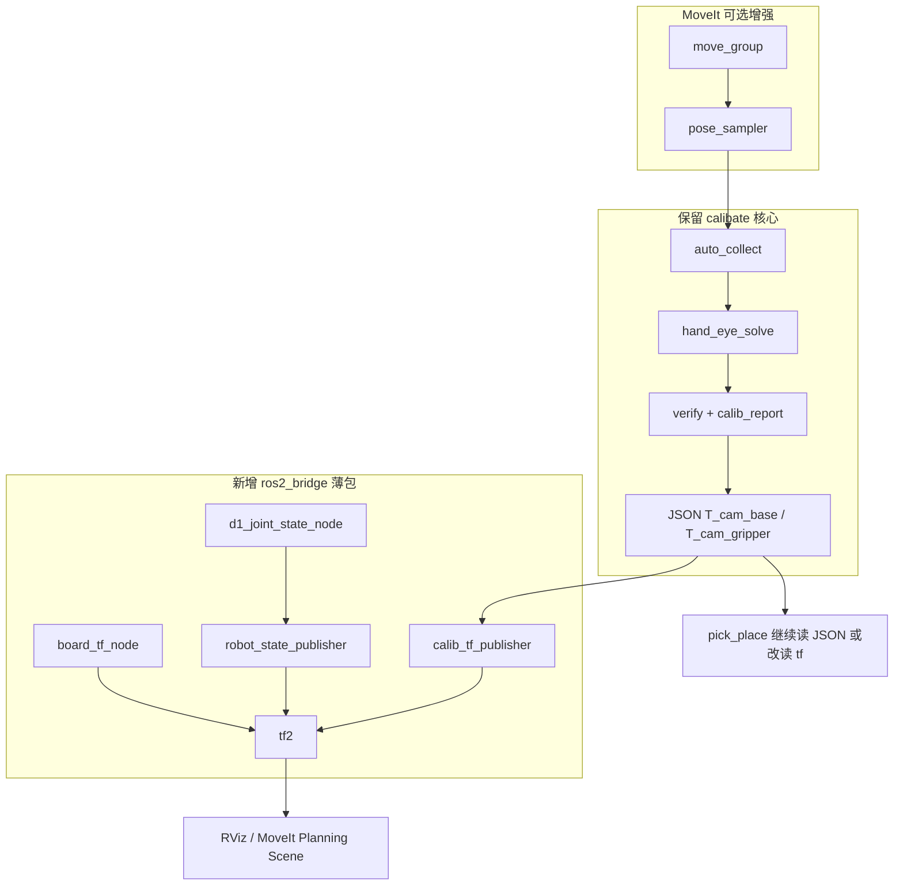

# ROS2 + MoveIt 演进路线图

本文给出未来接入 ROS2 与 MoveIt 时的架构决策与分阶段落地计划。

## 核心结论

**推荐：以 `calibate` 为核心，只从 easy_handeye2 / MoveIt 借「ROS2 胶水层」，不要整体迁到 easy_handeye2。**

| 方案 | 到能跑 | 到同等效果 | 维护成本 | 结论 |
|------|--------|------------|----------|------|
| A. fork [easy_handeye2](https://github.com/marcoesposito1988/easy_handeye2) | 4–8 周 | 8–12 周 | 需跟上游合并，D1 定制难回流 | 不推荐 |
| B. calibate + ROS2 桥接 | 2–4 周 | 4–6 周 | 单一代码库，ROS 只是适配层 | **推荐** |
| C. 完全自研 ROS2 标定 | 10+ 周 | 更久 | 最高 | 不推荐 |

### 理由

1. **真正昂贵的是 D1 上 ROS2 + MoveIt**（`robot_description`、`joint_states`、`move_group`、碰撞场景），不是手眼算法本身。
2. 现有 **D1 全自动采集、双相机、多算法融合、夹爪自动夹紧** 等能力，easy_handeye2 不具备。
3. 两者底层均使用 **OpenCV `calibrateHandEye`**，换框架不会明显提升精度，却会丢掉现有自动化。
4. D1 非标准 MoveIt 支持机型，无论选哪条路线，ROS 基础设施工作量相近。

## 推荐架构



### 保留不动（或少动）

| 模块 | 路径 | 理由 |
|------|------|------|
| 自动采集 | `calibate/common/auto_collect.py` | D1 真机流程是最大资产 |
| 多算法融合 | `calibate/common/hand_eye_solve.py` | 比 easy_handeye2 单算法更强 |
| 双相机融合 | `calibate/combined/hand_eye_fusion.py` | 项目差异化能力 |
| 双相机配置 | `calibate/config/cameras.json` | 已适配 D435I + 2M USB |
| JSON 结果 | `eye_*/output/T_cam_*.json` | `pick_place` 已在用，可渐进迁移 |

### 从 easy_handeye2 借鉴（不引入依赖）

| 借鉴点 | 自研实现 | 预估工作量 |
|--------|----------|------------|
| `publish.launch.py` 模式 | `calib_tf_publisher`：读 JSON → `static_transform_publisher` | ~1 天 |
| 四帧 tf 语义 | `base_link` / `ee_link` / `camera_optical_frame` / `calibration_target` | ~2 天 |
| 标定评估 | 封装现有 `calib_report.py` 为 ROS service | ~1 天 |
| 多标定命名空间 | `eye_to_hand` / `eye_in_hand` 两个 frame 前缀 | ~0.5 天 |

不必引入 easy_handeye2 依赖，避免 LGPL 耦合和 D1 定制难以合并的问题。

### 从 MoveIt 借什么

[MoveIt](https://moveit.picknik.ai/humble/doc/concepts/concepts.html) 在本项目中的角色是 **采姿规划器**，不是标定求解器：

| 阶段 | MoveIt 用途 |
|------|-------------|
| 标定采样本 | `move_group` 规划多样化、无碰撞位姿 → 导出关节角给 `auto_collect` |
| 抓取运行 | Planning Scene + 碰撞避免 |
| 运行时 | 手眼结果通过 `tf` 进入规划场景 |

## 分阶段落地计划

### Phase 0（约 1 周）— 最快见效

**目标**：ROS2 能「看见」机器人和标定结果，不改变现有标定/抓取流程。

```
ros2_bridge/
├── d1_joint_state_node      # D1 SDK → sensor_msgs/JointState
├── robot_state_publisher    # 标准包 + calibate/config/d1.urdf
└── calib_tf_publisher       # T_cam_base.json → tf2 static transform
```

- `pick_place` **继续读 JSON**
- RViz 中可同时看到机械臂 + 相机坐标系
- 零风险，不影响现有 `pick_place run.py calibrate`

**验收**：RViz 中 `base_link` → `ee_link` → `camera_color_optical_frame` 链条可见，与 JSON 外参一致。

### Phase 1（2–3 周）— 标定流程 ROS 化

```
ros2_bridge/
├── board_tf_node            # 棋盘/ArUco → calibration_target tf
└── handeye_calib_server     # 封装 collect + solve 为 ROS2 action/service
```

- 采集仍调用 `collect_hand_eye_samples()`
- 求解仍用 `hand_eye_solve` 融合
- 对外暴露「采样 → 计算 → 发布」流程，内核是 calibate

**验收**：通过 ROS service 触发一次完整标定，结果写入 JSON 并发布到 `tf`。

### Phase 2（3–4 周）— 接 MoveIt

```
moveit_config_d1/            # SRDF, planning groups, kinematics.yaml
ros2_bridge/
└── pose_sampler_node        # MoveIt 规划位姿 → poses.json / 驱动采集
```

- **不要**把求解迁到 MoveIt / easy_handeye2
- 将 `pose_planner.py` 的关节扰动逐步替换为 MoveIt 规划的末端位姿
- 碰撞、旋转多样性由 MoveIt 保证

**验收**：MoveIt 规划 12 个无碰撞位姿，自动完成采集 + 求解，残差不劣于 adaptive 模式。

### Phase 3（可选）— pick_place 读 tf

- [`pick_place/vision.py`](../../pick_place/vision.py) 增加 `TfVision` 后端，与现有 JSON 后端并存
- 渐进切换，不一次性重写

## Frame 命名规范（建议）

| Frame | 含义 |
|-------|------|
| `base_link` | 机械臂基座 |
| `ee_link` | 末端法兰 / TCP |
| `camera_color_optical_frame` | 相机光学中心（Z 朝前） |
| `calibration_target` | 棋盘格 / ArUco 标记坐标系 |

眼在手外发布：`base_link` → `camera_color_optical_frame`（来自 `T_cam_base` 取逆或按约定）

眼在手上发布：`ee_link` → `camera_color_optical_frame`（来自 `T_cam_gripper`）

## 拟新增包结构（未来 ROS2 工作空间）

```
ros2_bridge/                    # 未来 colcon 工作空间子包
├── package.xml
├── setup.py
├── d1_joint_state_node.py      # Phase 0
├── calib_tf_publisher.py       # Phase 0
├── board_tf_node.py            # Phase 1
├── handeye_calib_server.py     # Phase 1
└── pose_sampler_node.py        # Phase 2

moveit_config_d1/               # Phase 2
├── config/
│   ├── d1.srdf
│   ├── kinematics.yaml
│   └── joint_limits.yaml
└── launch/
    └── move_group.launch.py
```

本阶段（文档化）**不实现上述代码**，仅作为后续开发蓝图。

## 不推荐方案 A 的原因

若以 easy_handeye2 为主线：

```
D1 SDK → 写 ROS tf 桥 → aruco_ros/棋盘 tf → easy_handeye2 采样求解 → tf 发布
                ↑                                    ↑
         需新写                              丢掉 fusion/夹爪/双相机
```

- D1 无官方 MoveIt 配置，前置工作量与方案 B 相同
- 需把棋盘检测改成发 `tf`（或接 aruco_ros）
- `adaptive` 采姿、夹爪逻辑需 fork 进 easy_handeye2
- 双相机 `combined/` 完全不在其设计范围内
- 上游更新时 merge 痛苦

**适合**：标准 UR/Franka + RealSense + ArUco 的通用实验室，不太适合本 D1 定制栈。

## 一句话总结

> 手眼标定继续用 `calibate`；ROS2 只加「关节状态 + 标定 tf 发布 + 棋盘 tf」薄包；MoveIt 只接「无碰撞采姿」；easy_handeye2 当设计参考，不当依赖。

若只做一件事：**先做 Phase 0 的 `calib_tf_publisher` + `d1_joint_state_node`**，约 1 周内可在 RViz 验证标定是否正确，且完全不破坏现有 `pick_place run.py calibrate` 流程。

## 相关文档

- [双相机配置](dual_camera_setup.md)
- [差距分析](gap_analysis_vs_ros_tools.md)
- [calibate 使用说明](../../calibate/README.md)
